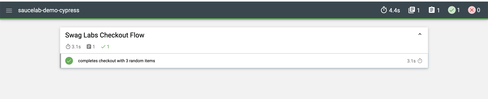
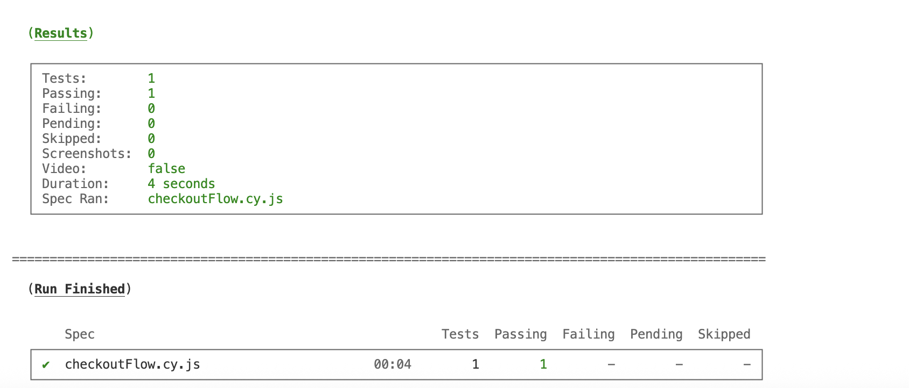

# Saucelab Demo Automation with Cypress + Javascript

## ✅ Objective
Automate a successful checkout process on [Sauce Labs Demo](https://www.saucedemo.com/) including:
- Logging in
- Randomly selecting 3 items
- Adding them to cart
- Checking out
- Verifying total and confirmation message

## ✅ Prerequisite
- Visual Studio Code
- node.js

## ✅ Setup Instructions
```bash
git clone https://github.com/syedmusab/saucelab-demo-cypress
cd saucelab-demo-cypress
npm install        # for installation of dependencies
npx cypress open   # for GUI execution
npx cypress run    # for headless execution and reporting
```

## ✅ Reporting
Reports are saved in:  
`cypress/reports/`
<br/>

 <br/>


## ✅ Credentials Used
- **Username:** `same as shared`
- **Password:** `same as shared`

## ✅ Author
- `Syed Musab Ali`

- `engineermusab@gmail.com`