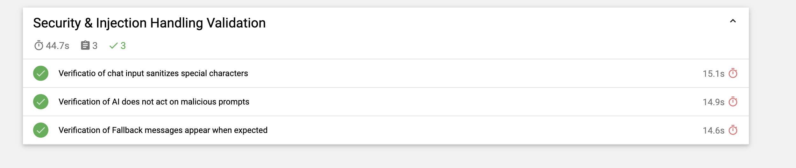
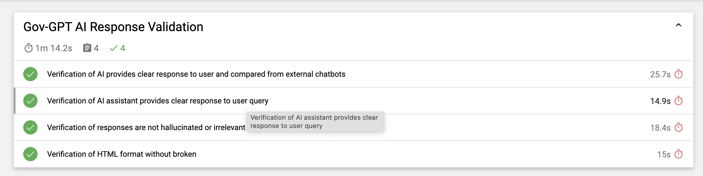
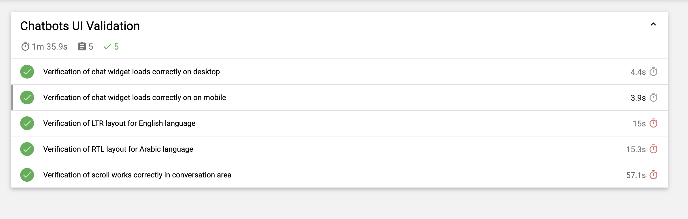

# Chatbot Automation Testing Framework - Gen AI

This project is an **end-to-end automation framework** for testing chatbot functionality using **Cypress**. It covers UI validation, chatbot response validation, sanitization, refusal, and fallback responses for both malicious and normal prompts.

---

## Table of Contents

- [Project Overview](#project-overview)  
- [Tech Stack](#tech-stack)  
- [Setup](#setup)   
- [Running Tests](#running-tests)  
- [Reports](#reports)  

---

## Project Overview

This framework automates validation of a chatbot's behavior:

- Verifies UI elements (chat widget, input box, scrolling).  
- Ensures multilingual support (LTR for English, RTL for Arabic).
- Verifies the responses of Gen AI from different platforms and checks their accuracy.
- Validates chatbot responses to **malicious prompts**:  
  - Sanitization (no `<script>` injection)  
  - Refusal responses  
  - Fallback responses  
- Supports reusable **Cypress custom commands** for cleaner test scripts.  

---

## Tech Stack

- [Cypress](https://www.cypress.io/) – E2E testing  
- JavaScript – Test scripting  
- Mocha & Chai – Assertions  
- Node.js – Runtime environment  

---

## Setup

## Prerequisite
- Visual Studio Code
- node.js

1. **Clone the repository**:  

- https://github.com/syedmusab/chatbot-automation-assessment.git 

2. **Command to install dependencies and run executions**

- npm install    # for installation of dependencies

## Running Tests
1. **npx cypress open**   # for GUI execution - (it will open modal from where files can be selected for execution)
2. **npx cypress run**    # for headless execution and reporting (report path will be populated in terminal window)

## Reports
Reports are saved in:  
`cypress/reports/`
 

  

  